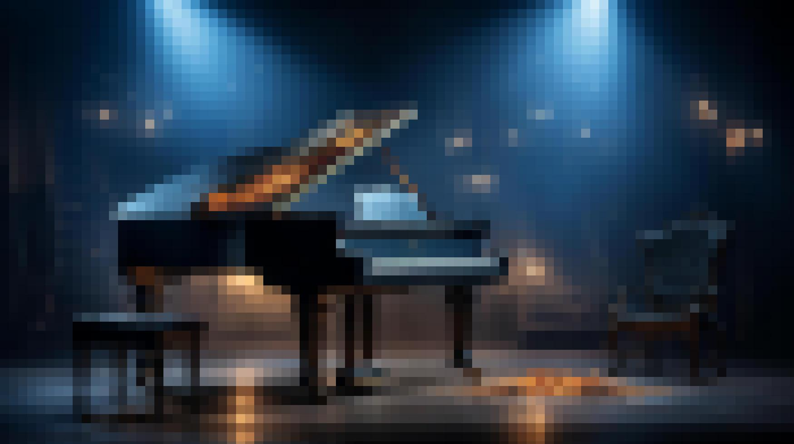

### Project Overview

This project is part of Advanced Software Paradigms course at ADA University. This project implements averaging operation on an image by dividing it into squares of a specified size and assigning each square the average color of its pixels. It can be performed using single-threaded or multi-threaded approach. The pixelation effect is displayed dynamically, with squares being updated progressively.

### Usage

##### Requirements
- Java 8 or higher

##### Compile the program
```java ImagePixelation.java```

##### Run the program
```java ImagePixelation <filename> <squareSize> <mode>```

- filename: Path to the image file to process. File should be in JPG format.
- squareSize: Size of the squares for pixelation.
- mode: S (Single-threaded processing) or M (Multi-threaded processing)

### Example
##### For ingle-threaded processing:
```java ImagePixelation test.jpg 20 S```
Processes test.jpg with square size 20 in single-threaded mode.

##### For multi-threaded processing:
```java ImagePixelation test.jpg 20 M```
Processes test.jpg with square size 20 in multi-threaded mode.

#### Input image


#### Processed image

The pixelated image is saved to result.jpg in the current directory.

### Used libraries
- Java Swing - Used for the graphical user interface.
- Java ImageIO - Used for handling image input and output.
- Java IO - Handles file operations.
- Java AWT - For image scaling and color management.
- Multi-threading - Uses Java’s ExecutorService for multi-threaded processing.

